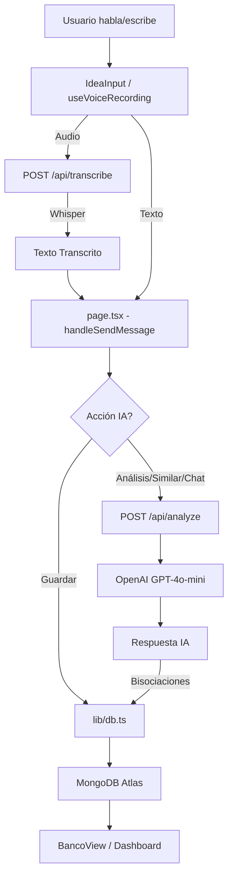

# 🏗️ Arquitectura del Banco de Ideas

## 📋 Resumen Ejecutivo

**Banco de Ideas** es una aplicación web interactiva que permite a los usuarios capturar, explorar y expandir sus ideas mediante un asistente de IA conversacional y entrada de voz. La aplicación utiliza **MongoDB** para la persistencia de datos y **OpenAI Whisper** para la transcripción de audio, permitiendo una experiencia fluida de captura de ideas.

## 🎯 Concepto Principal

La aplicación funciona como un "banco" donde depositas ideas y la IA te ayuda a:
- **Capturar ideas por voz** mediante Push-to-Talk (Whisper API)
- **Analizar** ideas desde diferentes perspectivas (viabilidad, mercado, riesgos)
- **Generar bisociaciones** (ideas similares o relacionadas) que se guardan automáticamente
- **Conversar** de forma natural para profundizar en conceptos

---

## 🏛️ Stack Tecnológico

```
Frontend:  Next.js 16 (App Router) + React 19 + TypeScript
Styling:   TailwindCSS 4
Backend:   Next.js API Routes (Serverless)
IA:        OpenAI GPT-4o-mini (Análisis) + Whisper-1 (Voz)
Storage:   MongoDB Atlas + Mongoose (Persistencia real)
Deploy:    Vercel (serverless)
```

---

## 📐 Arquitectura de Componentes

### 🎨 Frontend (Client Components)

```
app/
├── page.tsx              → Página principal (Chat Interface)
├── banco/page.tsx        → Vista del banco de ideas
├── about/page.tsx        → Página de filosofía y técnica
└── api/
    ├── analyze/route.ts  → API endpoint para IA (GPT)
    ├── transcribe/route.ts → API endpoint para Voz (Whisper)
    └── ideas/route.ts    → API endpoint para CRUD de ideas

hooks/
└── useVoiceRecording.ts  → Hook personalizado para gestión de audio y Whisper

components/
├── IdeaInput.tsx         → Input con capacidad dual (texto/voz)
├── ChatMessage.tsx       → Renderizado de mensajes del chat
└── BancoView.tsx         → Repositorio visual de ideas persistidas
```

### 🔄 Flujo de Datos



---

## 🧩 Componentes Clave

### 1. **`app/page.tsx`** - Orquestador de Chat

**Responsabilidades:**
- Gestión del estado conversacional y flujo de interacción.
- Coordinación entre el input de usuario y las respuestas de la IA.
- Control del estado de "primera interacción" para restringir el uso de voz.

### 2. **`hooks/useVoiceRecording.ts`** - Gestión de Voz [NUEVO]

Hook especializado que encapsula toda la complejidad de la Web Media API y la integración con Whisper:
- Gestión de permisos de micrófono.
- Captura de buffers de audio y detección de duración mínima.
- Comunicación con `/api/transcribe` para obtener el texto.
- Lógica de cancelación (soltar fuera del área activa).

### 3. **`app/api/analyze/route.ts`** - Motor de Inteligencia

Endpoint multifunción que procesa las intenciones del usuario:
- **similar**: Genera 3 ideas y las persiste automáticamente en MongoDB.
- **analysis**: Devuelve un informe estructurado de la idea.
- **chat**: Mantiene una conversación contextual libre.
- **save**: Persiste manualmente una idea del usuario.

```typescript
// Ejemplo de request
POST /api/analyze
{
  "action": "similar",
  "idea": "App de recetas con IA",
  "history": [...mensajes previos]
}
```

### 4. **`components/BancoView.tsx`** - Dashboard de Ideas

**Funcionalidad:**
- Carga ideas en tiempo real desde MongoDB vía `/api/ideas`.
- Filtrado dinámico por categoría (`user` | `bisociation`).
- Gestión de eliminación de ideas.
- Grid responsivo de tarjetas con diseño "glassmorphism".

### 5. **`lib/db.ts`** - Capa de Datos (Mongoose)

Abstracción sobre el modelo `Idea` de Mongoose que proporciona métodos CRUD seguros y tipados:
- `getIdeas()`: Recupera ideas ordenadas por fecha.
- `saveIdea()`: Valida y persiste una idea individual.
- `saveIdeas()`: Inserción por lotes para bisociaciones.
- `deleteIdea()`: Eliminación física de registros.

---

## 💾 Modelo de Datos

### Idea Schema (MongoDB)

```typescript
{
  text: { type: String, required: true },
  category: { 
    type: String, 
    enum: ['user', 'bisociation'], 
    default: 'user' 
  },
  createdAt: { type: Date, default: Date.now }
}
```

La comunicación entre API y Cliente utiliza el tipo `SavedIdea` para garantizar serialización limpia:

```typescript
type SavedIdea = {
  id: string;
  text: string;
  createdAt: string; // ISO String
  category: 'user' | 'bisociation';
}
```

---

## 🎨 Diseño Visual

### Paleta de Colores
- **Background**: `#F8F5F0` (Beige cálido que evoca papel/creatividad)
- **Primary**: `#C5A47E` (Dorado táctica/premium)
- **Accents**: `#1A1A1A` (Contraste elegante)

---

## 🧠 Decisiones de Diseño Clave

### Del Cliente al Servidor (MongoDB)
Originalmente el proyecto usaba LocalStorage. Se migró a **MongoDB Atlas** para:
- **Persistencia real**: Las ideas no se pierden al borrar caché o cambiar de navegador.
- **Escalabilidad**: Permitir búsquedas complejas y análisis agregados en el futuro.
- **Seguridad**: Los datos críticos residen en el servidor, no solo en el cliente.

### Push-to-Talk (Experiencia Pro)
En lugar de una grabación toggle (on/off), se implementó **Mantener para Grabar** (PointerEvents):
- **Menos errores**: El usuario es consciente de cuándo está capturando audio.
- **Rapidez**: Envío automático al soltar, acelerando el flujo creativo.

---

## 🔮 Roadmap
- [ ] Búsqueda semántica por vectores (RAG).
- [ ] Categorización automática por temas mediante IA.
- [ ] Exportación a formato Notion / Markdown.
- [ ] Autenticación de usuarios para bancos privados.

---

**Última actualización:** Diciembre 2024  
**Versión:** 1.1.0  
**Estado:** ✅ Estable y en producción en [unbancodeideas.com](https://unbancodeideas.com)
