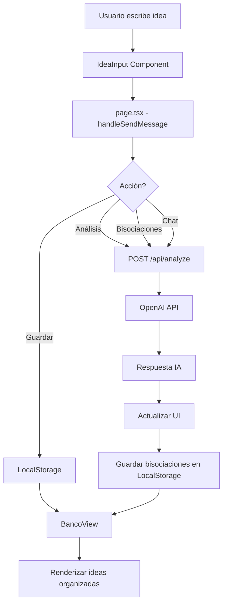

# 🏗️ Arquitectura del Banco de Ideas

## 📋 Resumen Ejecutivo

**Banco de Ideas** es una aplicación web interactiva que permite a los usuarios capturar, explorar y expandir sus ideas mediante un asistente de IA conversacional. La aplicación combina un chat inteligente con capacidades de análisis y generación de ideas relacionadas (bisociaciones), todo almacenado de forma persistente.

## 🎯 Concepto Principal

La aplicación funciona como un "banco" donde depositas ideas y la IA te ayuda a:
- **Analizar** ideas desde diferentes perspectivas (viabilidad, mercado, riesgos)
- **Generar bisociaciones** (ideas similares o relacionadas)
- **Conversar** de forma natural para profundizar en conceptos
- **Organizar** ideas propias vs. ideas generadas por IA

---

## 🏛️ Stack Tecnológico

```
Frontend:  Next.js 16 (App Router) + React 19 + TypeScript
Styling:   TailwindCSS 4
Backend:   Next.js API Routes (Serverless)
IA:        OpenAI GPT-4o-mini
Storage:   LocalStorage (cliente) + JSON file (desarrollo)
Deploy:    Vercel (serverless)
```

---

## 📐 Arquitectura de Componentes

### 🎨 Frontend (Client Components)

```
app/
├── page.tsx              → Página principal (Chat Interface)
├── banco/page.tsx        → Vista del banco de ideas
├── layout.tsx            → Layout global
└── api/
    └── analyze/route.ts  → API endpoint para IA

components/
├── IdeaInput.tsx         → Input para capturar ideas
├── ChatMessage.tsx       → Renderizado de mensajes del chat
└── BancoView.tsx         → Vista de ideas guardadas (con filtros)
```

### 🔄 Flujo de Datos



---

## 🧩 Componentes Clave

### 1. **`app/page.tsx`** - Chat Principal

**Responsabilidades:**
- Gestión del estado conversacional (mensajes, historial)
- Orquestación de acciones (análisis, bisociaciones, chat)
- Persistencia en LocalStorage
- Renderizado de la interfaz de chat

**Características destacadas:**
- Sistema de mensajes con roles (`user` | `assistant`)
- Botones de acción rápida (Analizar, Ideas Similares, Guardar)
- Scroll automático al último mensaje
- Manejo de estados de carga

```typescript
// Estructura de mensaje
type Message = {
  id: number;
  role: 'user' | 'assistant';
  content: React.ReactNode | string;
  plainText?: string; // Para enviar a la IA
}
```

### 2. **`app/api/analyze/route.ts`** - Backend IA

**Endpoint único** que maneja múltiples acciones mediante el parámetro `action`:

| Acción | Descripción | Respuesta |
|--------|-------------|-----------|
| `save` | Guarda idea del usuario | Confirmación |
| `similar` | Genera 3 ideas relacionadas | JSON con array de ideas |
| `analysis` | Análisis crítico de negocio | Markdown con análisis |
| `chat` | Conversación fluida | Texto natural |

**Características:**
- Manejo de contexto conversacional (historial completo)
- Prompts especializados por tipo de acción
- Formato JSON estructurado para bisociaciones
- Manejo robusto de errores

```typescript
// Ejemplo de request
POST /api/analyze
{
  "action": "similar",
  "idea": "App de recetas con IA",
  "history": [...mensajes previos]
}
```

### 3. **`components/BancoView.tsx`** - Repositorio de Ideas

**Funcionalidad:**
- Carga ideas desde LocalStorage
- Filtrado por categoría (`user` | `bisociation`)
- Vista de carpetas (navegación visual)
- Grid responsivo de tarjetas

**Diseño UX:**
- Vista inicial: "Mis Ideas" + carpeta "Bisociaciones"
- Al hacer clic en carpeta → muestra solo bisociaciones
- Breadcrumbs para navegación
- Indicador visual "IA" en ideas generadas

### 4. **`lib/db.ts`** - Capa de Persistencia

**Estrategia híbrida:**
- **Desarrollo local**: Escribe en `data/ideas.json`
- **Producción (Vercel)**: Read-only, delega a LocalStorage

```typescript
export function saveIdea(text: string, category: 'user' | 'bisociation'): SavedIdea
export function getIdeas(): SavedIdea[]
```

**Nota importante:** En Vercel, el filesystem es efímero, por lo que la persistencia real se hace en el cliente.

---

## 💾 Modelo de Datos

### SavedIdea (LocalStorage)

```typescript
{
  id: string;           // timestamp + random
  text: string;         // Contenido de la idea
  createdAt: string;    // ISO 8601
  category: 'user' | 'bisociation';
  date?: string;        // Compatibilidad legacy
}
```

**Storage Key:** `ideas_bank_v1`

### Message (Estado del Chat)

```typescript
{
  id: number;
  role: 'user' | 'assistant';
  content: React.ReactNode | string;  // Puede ser JSX (botones, listas)
  plainText?: string;                 // Versión texto para IA
}
```

---

## 🎨 Diseño Visual

### Paleta de Colores

```css
--background: #F8F5F0    /* Beige cálido */
--card: #FFFFFF          /* Blanco */
--gold: #C5A47E          /* Dorado suave */
--foreground: #1A1A1A    /* Texto principal */
```

### Componentes UI Destacados

- **Tarjetas de ideas**: Bordes sutiles, hover con sombra
- **Botones de acción**: Gradiente dorado, micro-animaciones
- **Input principal**: Minimalista, auto-focus, placeholder sutil
- **Carpeta de bisociaciones**: Icono de folder, efecto hover scale

---

## 🔐 Configuración y Deployment

### Variables de Entorno

```bash
OPENAI_API_KEY=sk-...  # Requerida para funcionalidad IA
```

### Scripts NPM

```json
{
  "dev": "next dev --webpack",
  "build": "next build --webpack",
  "start": "next start"
}
```

### Deployment en Vercel

- **Auto-deploy** desde Git
- **Edge Functions** para API routes
- **LocalStorage** como persistencia principal
- Ver `DEPLOY.md` para detalles

---

## 🚀 Flujos de Usuario Principales

### 1️⃣ Capturar y Analizar Idea

```
Usuario escribe idea → Clic "Analizar" 
→ IA devuelve análisis en Markdown 
→ Se muestra en chat con formato
→ Usuario puede hacer preguntas de seguimiento
```

### 2️⃣ Generar Bisociaciones

```
Usuario escribe idea → Clic "Ideas Similares"
→ IA genera 3 ideas relacionadas
→ Se muestran como lista interactiva
→ Usuario puede guardar las que le interesen
→ Se almacenan en LocalStorage con category='bisociation'
```

### 3️⃣ Guardar y Organizar

```
Usuario escribe idea → Clic "Guardar"
→ Se guarda en LocalStorage con category='user'
→ Visible en /banco en la sección "Mis Ideas"
→ Bisociaciones aparecen en carpeta separada
```

---

## 🧠 Decisiones de Diseño Clave

### ¿Por qué LocalStorage?

- **Vercel es serverless**: El filesystem es efímero entre invocaciones
- **Inmediatez**: No requiere backend persistente
- **Simplicidad**: Ideal para MVP y uso personal
- **Migración futura**: Fácil de reemplazar por DB (Supabase, Firebase)

### ¿Por qué un solo endpoint `/api/analyze`?

- **Reutilización de contexto**: Todas las acciones comparten historial
- **Simplicidad**: Un solo punto de integración con OpenAI
- **Flexibilidad**: Fácil añadir nuevas acciones

### ¿Por qué Next.js App Router?

- **Server Components**: Optimización automática
- **API Routes integradas**: Backend sin configuración extra
- **File-based routing**: Estructura clara y escalable
- **Vercel-optimized**: Deploy sin fricción

---

## 📊 Diagrama de Arquitectura Completo

```mermaid
graph TB
    subgraph "Cliente (Browser)"
        A[IdeaInput] --> B[page.tsx]
        B --> C[ChatMessage]
        B --> D[LocalStorage]
        E[BancoView] --> D
    end
    
    subgraph "Servidor (Vercel)"
        F[/api/analyze] --> G[OpenAI API]
        H[lib/db.ts] -.->|dev only| I[data/ideas.json]
    end
    
    B -->|POST /api/analyze| F
    G -->|respuesta| F
    F -->|JSON/Markdown| B
    
    style A fill:#C5A47E,color:#fff
    style E fill:#C5A47E,color:#fff
    style G fill:#10a37f,color:#fff
```

---

## 🔮 Posibles Mejoras Futuras

### Persistencia
- [ ] Migrar a Supabase/Firebase para persistencia real
- [ ] Sincronización multi-dispositivo
- [ ] Export/Import de ideas (JSON, Markdown)

### Funcionalidad
- [ ] Etiquetas y categorías personalizadas
- [ ] Búsqueda full-text
- [ ] Relaciones entre ideas (grafo)
- [ ] Modo colaborativo (compartir ideas)

### IA
- [ ] Generación de imágenes para ideas
- [ ] Análisis de tendencias en el banco
- [ ] Sugerencias proactivas basadas en historial

### UX
- [ ] Modo oscuro
- [ ] Atajos de teclado
- [ ] Arrastrar y soltar para organizar
- [ ] Vista de timeline

---

## 📚 Recursos y Referencias

- [Next.js Documentation](https://nextjs.org/docs)
- [OpenAI API Reference](https://platform.openai.com/docs)
- [TailwindCSS](https://tailwindcss.com)
- [Vercel Deployment](https://vercel.com/docs)

---

## 👥 Contacto y Contribuciones

Este proyecto es personal, pero abierto a sugerencias y mejoras. Si tienes ideas para expandir el concepto, ¡adelante!

---

**Última actualización:** Diciembre 2024  
**Versión:** 1.0.0  
**Estado:** ✅ Funcional en producción
